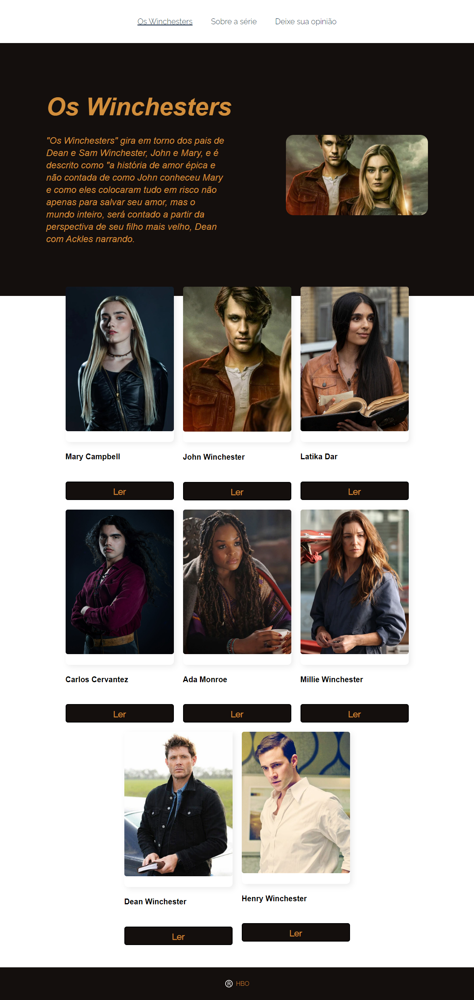
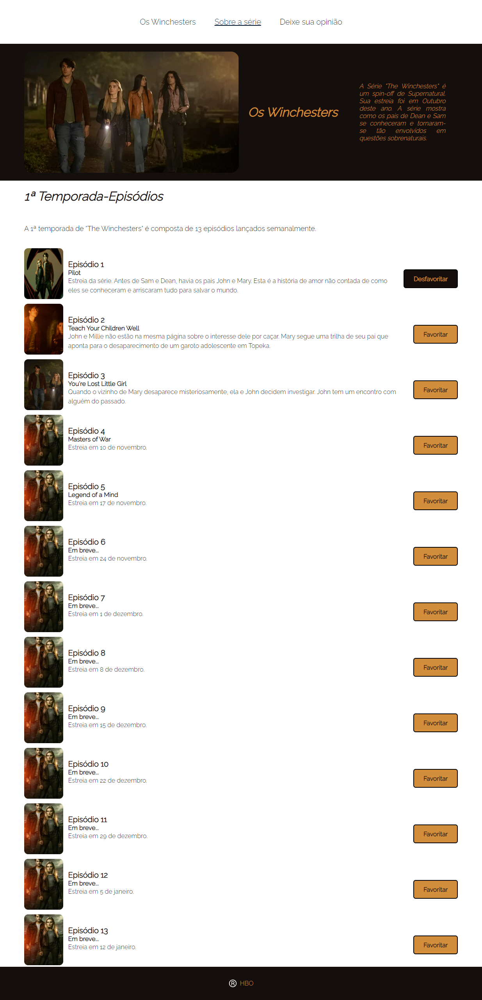
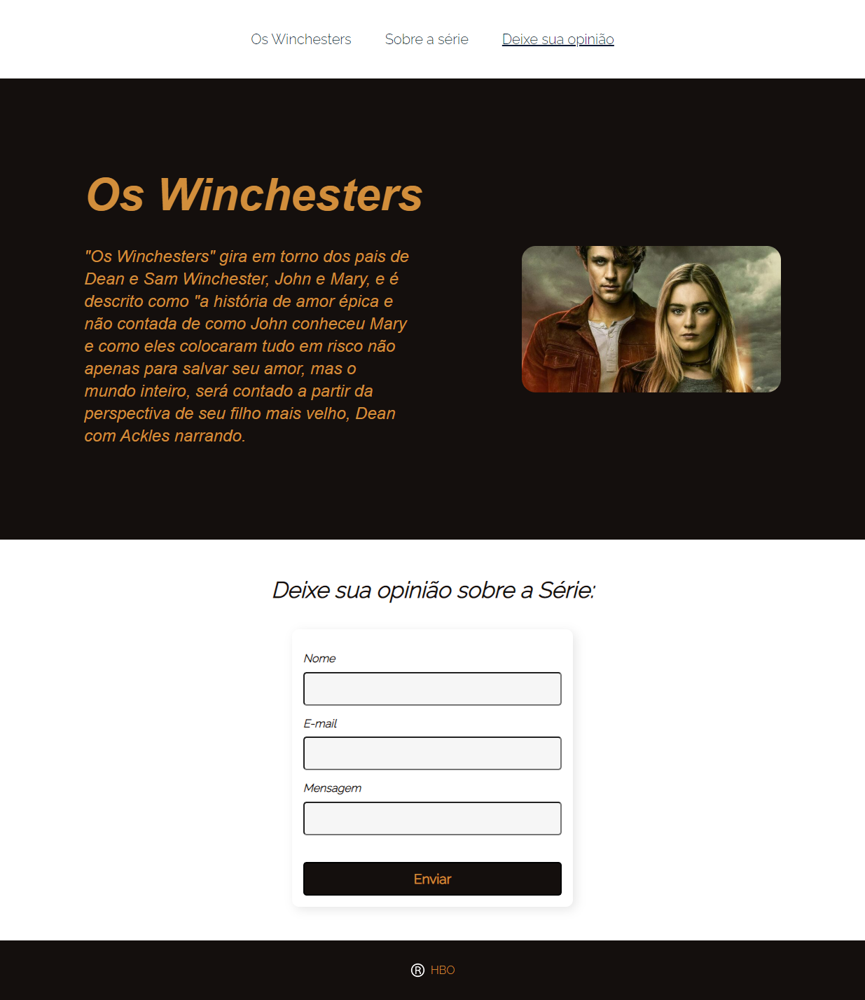

# Projeto Blog

📌 Este projeto foi desenvolvido durante as aulas do Módulo de React no programa VemSer10

# Para iniciar o projeto você precisa do comando:
### `npm start`

## Página Inicial

## Página Sobre a Série

## Página de Opinião

